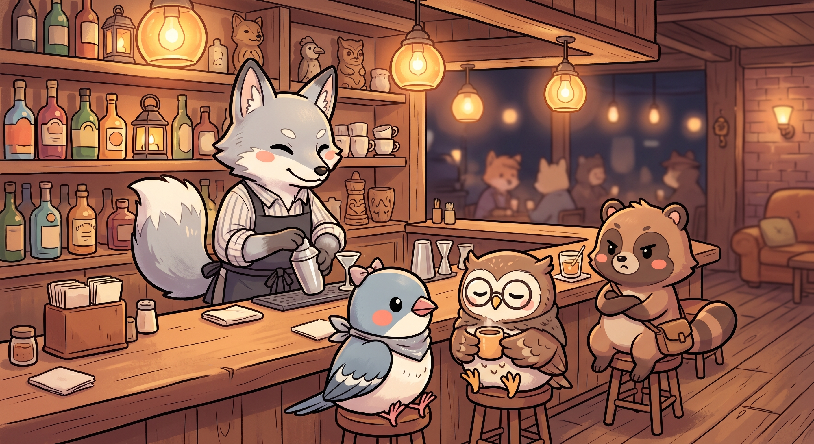
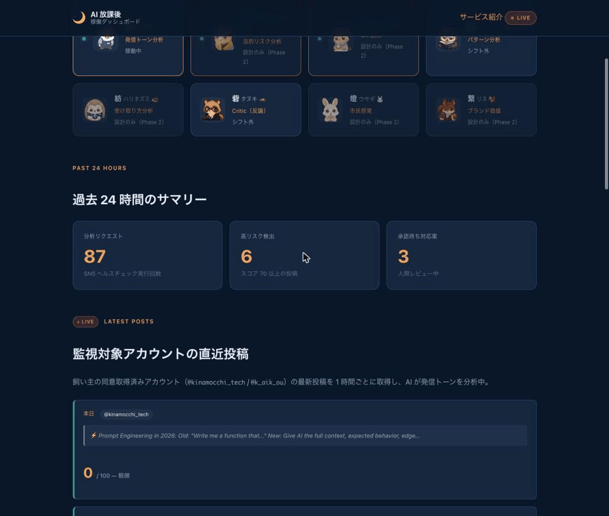

# After-Hours Agents — AI 放課後 / 夜間自律エージェント

<p align="center">
  
</p>

<p align="center">
  <strong>"おはようございます、昨夜の失敗、直しておきました。"</strong>
</p>

<p align="center">
  <a href="https://func-aha-dev.azurewebsites.net/api/dashboard">
    
  </a>
  <a href="https://github.com/kai-kou/nocturne-agents/blob/main/docs/zenn-article-draft.md">
    
  </a>
  
</p>

---

**Microsoft Agent Hackathon 2026** 提出プロダクト。

SNS ヘルスチェックを **昼は AI が検知・提案、夜は AI が反省・改善** するシフト制マルチエージェントシステム。
Human-in-the-loop 設計により、AI は **提案まで** を担当し、実行は必ず人間が承認する。

---

## プロダクト概要 / Product Overview

**日本語**: X（旧 Twitter）で SNS ヘルスリスクの高い投稿を検知し、専門エージェント 3 体が連携して発信トーン改善案を作成。
夜間は自律的に振り返り Group Chat を行い、翌朝に改善 PR を自動作成する。

**English**: A multi-agent system that monitors X (Twitter) for communication health risks, coordinates three specialized
agents to draft responses, and autonomously runs overnight retrospectives to create improvement PRs by morning.

---

## ライブデモ / Live Demo

**稼働中デプロイ**: [https://func-aha-dev.azurewebsites.net/api/dashboard](https://func-aha-dev.azurewebsites.net/api/dashboard)

<p align="center">
  
</p>

上の GIF: ダッシュボード LP → SNS ヘルスチェック送信 → **リスクスコア 25/100** 判定のフロー。

<p align="center">
  
</p>

上の画像: `/api/console` — エージェント稼働状況・24h サマリーのリアルタイムダッシュボード。

---

## デモ動画 / Demo Video

[](https://youtu.be/ImoKmMnqR28)

[](https://youtu.be/ImoKmMnqR28)

▶ **https://youtu.be/ImoKmMnqR28** （4分57秒）

ハムスターの「もっちー」とセキセイインコの「きなこ」が、実際のダッシュボードを操作しながら After-Hours Agents の仕組み（昼夜2レーン・8体のエージェント・ノクターン会議・Human-in-the-loop）を解説します。

---

## 看板 3 体 / Core Agents

| # | 和名 | 英名 | 動物 | キャッチフレーズ | シフト |
|---|------|------|------|----------------|--------|
| Mio-01 | **澪** | Mio | 文鳥 🐦 | 「この投稿、3時間後に燃えます」 | 日勤 09:00–18:00 |
| Toride-06 | **砦** | Toride | タヌキ 🦝 | 「反論できない対応は次の炎上の種」 | 夜勤 18:00–03:00 |
| Yomi-04 | **読** | Yomi | フクロウ 🦉 | 「同じ火は、同じ場所からまた燃える」 | 夜勤 18:00–03:00 |

<p align="center">
  
</p>

読は飲み会に参加しません。議事録だけ送ってきます。

---

## アーキテクチャ / Architecture

```
┌─────────────────── 昼レーン (Daytime Lane) ────────────────────┐
│                                                                  │
│  X API ──1時間ポーリング──► 澪 (Mio-01)                         │
│                              │ スコアリング + LLM 分析           │
│                              ▼                                   │
│                      Adaptive Card 送信                          │
│                              │                                   │
│                       ┌──────┴──────┐                           │
│                       ▼             ▼                            │
│                  [承認] ──── Copilot Studio ──── [修正/キャンセル]│
│                       │                                          │
│                       ▼                                          │
│                 X 投稿実行 (Tweepy)                              │
└──────────────────────────────────────────────────────────────────┘

┌─────────────────── 夜レーン (Nighttime Lane) ───────────────────┐
│                                                                  │
│  JST 23:00 Timer ──► 砦 (Toride-06) ──┐                         │
│                                        ├─► AutoGen Group Chat    │
│                      読 (Yomi-04) ────┘         │               │
│                                                 ▼               │
│                                        改善アクション抽出         │
│                                                 │               │
│                                       GitHub PR Draft 作成       │
│                                                 │               │
│  JST 08:00 ─────────────────────── Teams Digest 送信             │
│  Morning Digest Timer                           │               │
│                                          人間がレビュー           │
│                                          & マージ承認            │
└──────────────────────────────────────────────────────────────────┘

共通インフラ:
  Azure Functions (Python 3.11) + Cosmos DB + Entra Agent ID (RBAC)
  AutoGen 0.4.9 GroupChat + Copilot Studio Adaptive Card
```

詳細アーキテクチャ図は [`docs/images/architecture.md`](docs/images/architecture.md) を参照。

---

## 技術スタック / Tech Stack

| レイヤー | 採用技術 |
|---------|---------|
| エージェント基盤 | AutoGen 0.4.9 (`AssistantAgent` + `RoundRobinGroupChat`) |
| ホスティング | Azure Functions (Python 3.11, Consumption Plan) |
| データ永続化 | Azure Cosmos DB for NoSQL |
| 認証・権限管理 | Entra Agent ID + Managed Identity (RBAC) |
| 人間承認フロー | Microsoft Teams Adaptive Card + Copilot Studio |
| SNS 連携 | X API v2 (Tweepy) |
| CI/CD | GitHub Actions + OIDC (シークレット不要) |
| テスト | pytest + pytest-asyncio |

---

## セットアップ / Setup

### 前提条件 / Prerequisites

- Python 3.11+
- Azure Functions Core Tools v4
- Azure CLI (`az login` 済み)
- X API v2 認証情報（Bearer Token + OAuth 1.0a）

### ローカル起動 / Local Start

```bash
# 1. 依存インストール
pip install -r src/requirements.txt

# 2. 設定ファイル生成（Azure リソースが必要）
bash scripts/provision.sh dev

# 3. ローカル起動
cd src && func start

# 4. ヘルスチェック
curl http://localhost:7071/api/health
```

### テスト / Testing

```bash
cd src && python -m pytest tests/unit/ -v
```

---

## API エンドポイント / Endpoints

ライブ: `https://func-aha-dev.azurewebsites.net`  
詳細は [`docs/endpoints.md`](docs/endpoints.md) を参照。

| Method | Path | 説明 / Description |
|--------|------|--------------------|
| GET | `/api/health` | ヘルスチェック |
| GET | `/api/dashboard` | ダッシュボード LP |
| GET | `/api/console` | 管理コンソール（稼働状況・サマリー） |
| POST | `/api/day/analyze` | 澪による手動分析 |
| POST | `/api/day/approve` | Copilot Studio 承認 Webhook |
| POST | `/api/night/nocturne/start` | 夜間 Group Chat 手動起動 |
| POST | `/api/night/pr-draft` | GitHub PR Draft 作成 |
| POST | `/api/morning/digest/test` | Morning Digest 手動送信 |

---

## ディレクトリ構成 / Directory Structure

```
nocturne-agents/
├── src/
│   ├── agents/
│   │   ├── mio_01/         # 澪: SNS ヘルスチェック・対応案生成
│   │   ├── toride_06/      # 砦: 批評・エスカレーション判断
│   │   └── yomi_04/        # 読: パターン分類・知識蓄積
│   ├── blueprints/
│   │   ├── day_lane.py     # 昼レーン (X ポーリング・承認フロー)
│   │   └── night_lane.py   # 夜レーン (Group Chat・PR Draft・Digest)
│   ├── personas/           # Persona Card YAML (各エージェント人格定義)
│   ├── shared/             # Cosmos DB クライアント・Pydantic モデル
│   └── tests/unit/         # pytest ユニットテスト
├── scripts/
│   ├── provision.sh        # Azure リソース自動プロビジョニング (Bicep IaC)
│   ├── deploy.sh           # Azure Functions デプロイ
│   └── azure-auth.sh       # Azure 認証ヘルパー
├── docs/
│   ├── endpoints.md        # デプロイ済み URL 一覧
│   ├── demo-guide.md       # デモ手順書
│   ├── zenn-article-draft.md  # Zenn 記事ドラフト
│   └── images/             # アーキテクチャ図
├── assets/demo/            # スクリーンショット・デモ素材
└── .github/workflows/      # CI/CD (provision / deploy / OIDC)
```

---

## ライセンス / License

Apache-2.0

---

## 関連リンク / Links

- [ライブデモ](https://func-aha-dev.azurewebsites.net/api/dashboard) — 稼働中の Azure Functions
- [Zenn 記事ドラフト](docs/zenn-article-draft.md)
- [デモ手順書](docs/demo-guide.md)
- [エンドポイント一覧](docs/endpoints.md)
- [アーキテクチャ図](docs/images/architecture.md)
- 提出用リポジトリ: [`kai-kou/nocturne-agents`](https://github.com/kai-kou/nocturne-agents)
