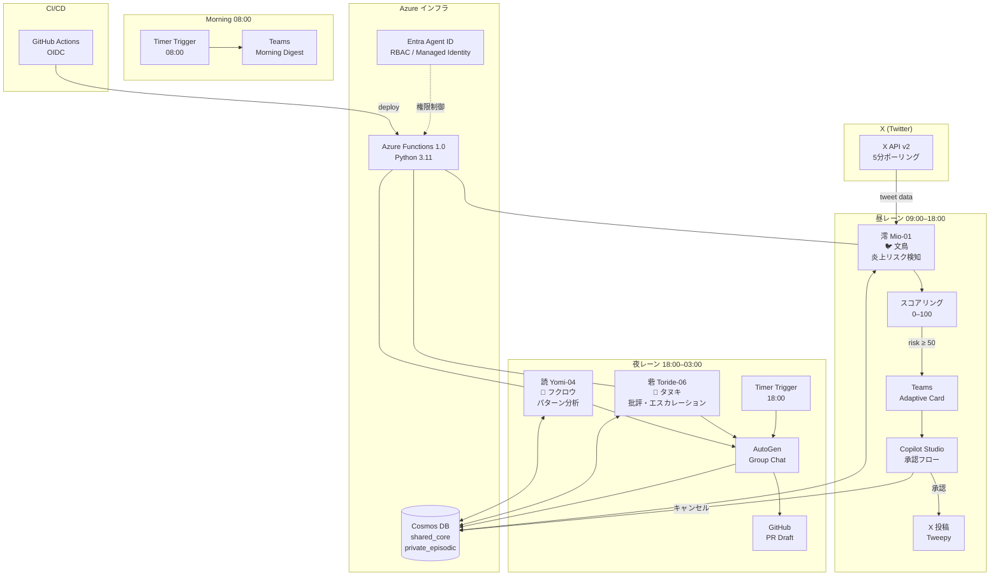

# アーキテクチャ図 — After-Hours Agents

## システム全体図 (Mermaid)



## コンポーネント説明

### エージェント

| エージェント | 役割 | AutoGen 型 | 記憶タイプ |
|------------|------|-----------|----------|
| 澪 (Mio-01) | X 監視・リスクスコアリング・対応案生成 | `AssistantAgent` | `Incident`, `Memory` |
| 砦 (Toride-06) | 対応批評・エスカレーション判断 | `AssistantAgent` | `Memory`, `AgentKnowledge` |
| 読 (Yomi-04) | パターン分類・類似インシデント検索 | `AssistantAgent` | `AgentKnowledge` |

### データフロー

```
Incident 作成 (澪)
    │
    ├── shared_core コンテナ
    │   └── type: "Incident" — 全エージェント共有
    │
    └── private_episodic コンテナ
        ├── type: "Memory"        — 各エージェントの記憶
        └── type: "AgentKnowledge" — 蓄積された知識
```

### Human-in-the-loop ポイント

```
昼: Adaptive Card → [承認/修正/キャンセル] → X 投稿
夜: PR Draft 作成 → 翌朝レビュー → マージ承認
```

AI は **提案まで** 。実行は必ず人間が承認する。

## Persona Card YAML 構造

```yaml
# personas/mio_01.yaml
agent_id: mio-01
name: 澪
species: 文鳥
shift: daytime
persona:
  business_mode:
    tone: "冷静・データドリブン"
    forbidden_words: ["大丈夫", "問題ない", "きっと"]
  casual_mode:
    tone: "親しみやすい・わかりやすい"
scoring:
  high_threshold: 80
  medium_threshold: 50
```

## セキュリティ設計

| 項目 | 設計 |
|------|------|
| 認証 | Entra Agent ID (Managed Identity) — シークレット不使用 |
| 権限 | RBAC 最小権限 (Cosmos DB 読取/書込のみ) |
| CI/CD | GitHub Actions OIDC (Workload Identity Federation) |
| Secrets | Azure Functions Application Settings (暗号化) |
